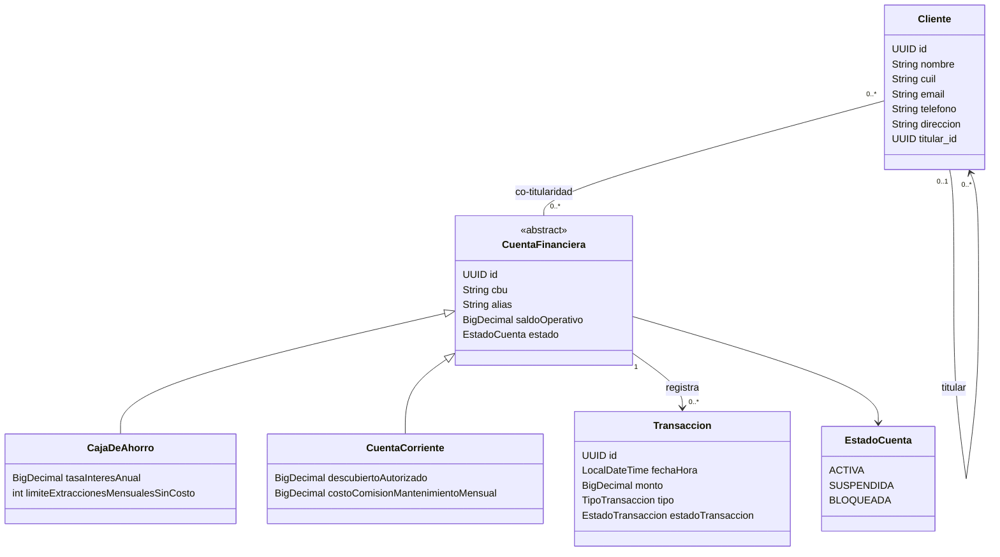

<h1 align="center">🏦 Sistema Bancario</h1>

 
  <strong>Desarrollo y Arquitecturas Avanzadas de Software</strong>  
  Ingeniería en Informática · Universidad Nacional de Jujuy   
   
   
   
   
   
   
   

<h2>📌 Descripción</h2>

 Sistema bancario desarrollado para la asignatura <strong>Desarrollo y Arquitecturas Avanzadas de Software</strong> de la carrera Ingeniería en Informática de la Universidad Nacional de Jujuy. 

 El proyecto modela el núcleo de un sistema bancario, contemplando la gestión de clientes, cuentas financieras y transacciones, junto con su persistencia mediante JPA/Hibernate sobre MySQL. 

La implementación aplica conceptos de:

<ul> 
  <li>Programación Orientada a Objetos.</li> 
  <li>Herencia de entidades.</li> 
  <li>Relaciones entre entidades.</li> 
  <li>Tipos enumerados.</li> 
  <li>Persistencia mediante Jakarta Persistence (JPA).</li> 
  <li>Mapeo objeto-relacional mediante Hibernate ORM.</li> 
  <li>Auditoría automática de entidades.</li> 
  <li>Integridad referencial.</li> 
  <li>Repositorios mediante Spring Data JPA.</li> 
  <li>Query Methods mediante convención de nombres.</li> 
  <li>Pruebas de integración sobre una instancia real de MySQL.</li> 
</ul>

<h2>🏦 Dominio del sistema</h2>

 El sistema representa las principales entidades involucradas en la gestión de clientes, cuentas bancarias y operaciones financieras. 

<h3>👤 Clientes</h3>

 Un <code>Cliente</code> representa una persona o entidad registrada en el sistema bancario. Cada cliente posee: 

<ul> 
  <li>Identificador UUID.</li> 
  <li>Nombre o Razón Social.</li> 
  <li>CUIL.</li> 
  <li>Email.</li> 
  <li>Teléfono.</li> 
  <li>Dirección.</li> 
  <li>Fecha de creación.</li> 
  <li>Fecha de última modificación.</li> 
</ul>

 El modelo contempla además una relación reflexiva entre clientes mediante la cual un cliente puede estar asociado a otro cliente como titular. 

<h3>💳 Cuentas financieras</h3>

 <code>CuentaFinanciera</code> constituye la abstracción base para los diferentes productos de cuentas bancarias. 

 La entidad es abstracta y utiliza herencia JPA mediante: 

<pre><code class="language-java">@Inheritance(strategy = InheritanceType.JOINED)</code></pre>

Cada cuenta financiera posee:

<ul> 
  <li>Identificador UUID.</li> 
  <li>CBU.</li> 
  <li>Alias.</li> 
  <li>Saldo operativo.</li> 
  <li>Estado.</li> 
  <li>Fecha de creación.</li> 
  <li>Fecha de última modificación.</li> 
</ul>

El estado de una cuenta se representa mediante <code>EstadoCuenta</code>:

<ul> 
  <li><code>ACTIVA</code></li> 
  <li><code>SUSPENDIDA</code></li> 
  <li><code>BLOQUEADA</code></li> 
</ul>

El sistema contempla dos especializaciones:

<ol> 
  <li><code>CajaDeAhorro</code></li> 
  <li><code>CuentaCorriente</code></li> 
</ol>

<h3>💰 Caja de Ahorro</h3>

 <code>CajaDeAhorro</code> hereda de <code>CuentaFinanciera</code> y agrega: 

<ul> 
  <li><code>tasaInteresAnual</code></li> 
  <li><code>limiteExtraccionesMensualesSinCosto</code></li> 
</ul>

<h3>🏧 Cuenta Corriente</h3>

 <code>CuentaCorriente</code> hereda de <code>CuentaFinanciera</code> y agrega: 

<ul> 
  <li><code>descubiertoAutorizado</code></li> 
  <li><code>costoComisionMantenimientoMensual</code></li> 
</ul>

 Los importes monetarios se representan mediante <code>BigDecimal</code>. 

<h3>🔄 Transacciones</h3>

 <code>Transaccion</code> representa una operación realizada sobre una cuenta financiera. Cada transacción posee: 

<ul> 
  <li>Identificador UUID.</li> 
  <li>Fecha y hora.</li> 
  <li>Monto.</li> 
  <li>Tipo de transacción.</li> 
  <li>Estado de procesamiento.</li> 
  <li>Cuenta financiera asociada.</li> 
  <li>Fecha de creación.</li> 
  <li>Fecha de última modificación.</li> 
</ul>

Los tipos de transacción disponibles son:

<ul> 
  <li><code>DEPOSITO</code></li> 
  <li><code>EXTRACCION</code></li> 
  <li><code>TRANSFERENCIA_ENVIADA</code></li> 
  <li><code>TRANSFERENCIA_RECIBIDA</code></li> 
</ul>

El estado de procesamiento se representa mediante:

<ul> 
  <li><code>PENDIENTE</code></li> 
  <li><code>COMPLETADA</code></li> 
  <li><code>RECHAZADA</code></li> 
  <li><code>REVERTIDA</code></li> 
</ul>

 Cada transacción pertenece a una cuenta financiera, manteniendo una relación de persistencia entre <code>Transaccion</code> y <code>CuentaFinanciera</code>. 

<h2>🧱 Arquitectura</h2>

 La implementación se concentra actualmente en el modelo de dominio y la persistencia. El acceso a los datos se organiza mediante Spring Data JPA sobre Hibernate ORM. 

<pre><code>┌─────────────────────────────┐
│       Modelo de Dominio     │
│  Entidades + Enumeraciones  │
└──────────────┬──────────────┘
               │
┌──────────────▼──────────────┐
│         Repository          │
│      Acceso a datos         │
└──────────────┬──────────────┘
               │
┌──────────────▼──────────────┐
│       JPA / Hibernate       │
│        Persistencia ORM     │
└──────────────┬──────────────┘
               │
┌──────────────▼──────────────┐
│           MySQL             │
│        Base de datos        │
└─────────────────────────────┘</code></pre>

<h2>🛠️ Tecnologías</h2>

<table> 
  <thead> 
    <tr> <th>Tecnología</th> <th>Versión / Uso</th> </tr> 
  </thead> 
  <tbody> 
    <tr> <td><strong>Java</strong></td> <td>25</td> </tr> 
    <tr> <td><strong>Spring Boot</strong></td> <td>4.1.1</td> </tr> 
    <tr> <td><strong>Spring Data JPA</strong></td> <td>Persistencia y repositorios</td> </tr> 
    <tr> <td><strong>Hibernate ORM</strong></td> <td>7.4.5.Final</td> </tr> 
    <tr> <td><strong>MySQL</strong></td> <td>8.4.11</td> </tr> 
    <tr> <td><strong>Maven Wrapper</strong></td> <td>Gestión y ejecución del proyecto</td> </tr> 
    <tr> <td><strong>Lombok</strong></td> <td>Reducción de código repetitivo</td> </tr> 
    <tr> <td><strong>JUnit</strong></td> <td>Pruebas automatizadas</td> </tr> 
  </tbody> 
</table>

<h2>🗄️ Persistencia e integridad</h2>

 La persistencia se implementa utilizando Jakarta Persistence (JPA) con Hibernate ORM sobre MySQL. Hibernate realiza el mapeo entre las entidades Java y las tablas relacionales correspondientes. 

<h3>Identificadores</h3>

 Las entidades utilizan identificadores de tipo <code>UUID</code> generados mediante: 

<pre><code class="language-java">@GeneratedValue(strategy = GenerationType.UUID)</code></pre>

 En MySQL estos identificadores son almacenados como valores binarios. 

<h3>Restricciones de cuentas</h3>

 Las cuentas financieras poseen restricciones de persistencia sobre sus identificadores bancarios: 

<pre><code>CBU 
├── obligatorio 
├── único 
└── longitud máxima: 22 caracteres 

Alias 
├── obligatorio 
└── único</code></pre>

 El esquema generado por Hibernate refleja estas restricciones mediante columnas <code>NOT NULL</code>, índices únicos y claves primarias. 

<h3>Valores monetarios</h3>

 Los importes financieros utilizan <code>BigDecimal</code> y se almacenan mediante columnas decimales. 

<pre><code class="language-sql">decimal(19,2)</code></pre>

 Esto permite representar importes monetarios sin recurrir a tipos de punto flotante. 

<h2>🧬 Herencia JPA</h2>

 La jerarquía de cuentas utiliza la estrategia: 

<pre><code class="language-java">@Inheritance(strategy = InheritanceType.JOINED)</code></pre>

El modelo queda estructurado de la siguiente manera:

<pre><code>                 CuentaFinanciera
                       │
              ┌────────┴────────┐
              │                 │
       CajaDeAhorro      CuentaCorriente</code></pre>

 Con <code>JOINED</code>, los atributos comunes de <code>CuentaFinanciera</code> se almacenan en la tabla <code>cuentas_financieras</code>, mientras que los atributos específicos de cada subtipo se almacenan en sus respectivas tablas: 

<ul> 
  <li><code>cajas_de_ahorro</code></li> 
  <li><code>cuentas_corrientes</code></li> 
</ul>

 Las tablas de las especializaciones utilizan el mismo identificador de la cuenta financiera como clave primaria y referencia a la tabla padre. 

<h2>🔗 Relaciones entre entidades</h2>

 El modelo implementa las relaciones necesarias para representar el dominio bancario. 

<h3>Cliente — Cuenta Financiera</h3>

 Un cliente puede poseer una o más cuentas y una cuenta puede pertenecer a múltiples clientes mediante una relación de co-titularidad. 

 La relación se materializa mediante una tabla intermedia: 

<pre><code>clientes_cuentas 
├── cliente_id 
└── cuenta_id</code></pre>

 La clave primaria está compuesta por <code>(cliente_id, cuenta_id)</code>, representando una relación muchos-a-muchos entre clientes y cuentas. 

<h3>Cliente — Cliente</h3>

 El modelo contempla una relación reflexiva entre clientes mediante: 

<pre><code>clientes 
└── titular_id</code></pre>

 Esta relación permite representar la estructura de titularidad definida en el modelo. 

<h3>Cuenta Financiera — Transacción</h3>

 Una cuenta financiera puede registrar múltiples transacciones. La relación se materializa mediante: 

<pre><code>transacciones 
└── cuenta_id</code></pre>

 La columna <code>cuenta_id</code> constituye una clave foránea hacia <code>cuentas_financieras</code>. 

 La relación se encuentra respaldada por una restricción de no nulidad, por lo que una <code>Transaccion</code> requiere una cuenta financiera asociada para poder persistirse. 

<h2>🕒 Auditoría</h2>

 Las entidades auditables utilizan la clase base <code>EntidadAuditable</code>, definida como una <code>@MappedSuperclass</code>. 

La auditoría utiliza:

<pre><code class="language-java">@CreatedDate 
@LastModifiedDate</code></pre>

 junto con: 

<pre><code class="language-java">@EntityListeners(AuditingEntityListener.class)</code></pre>

 La aplicación habilita la funcionalidad mediante: 

<pre><code class="language-java">@EnableJpaAuditing</code></pre>

 De esta manera se registran automáticamente las fechas de: 

<ul> 
  <li><code>fechaCreacion</code></li> 
  <li><code>fechaModificacion</code></li> 
</ul>

 La funcionalidad fue verificada mediante pruebas de integración con Spring Boot y JPA. 

<h2>📦 Capa Repository</h2>

 El acceso a los datos se implementa mediante interfaces de <code>JpaRepository</code>. Esto permite utilizar las operaciones CRUD proporcionadas por Spring Data JPA sin implementar manualmente las operaciones básicas de persistencia. 

Los repositorios implementados son:

<pre><code>repository/ 
├── CajaDeAhorroRepository 
├── ClienteRepository 
├── CuentaCorrienteRepository 
├── CuentaFinancieraRepository 
└── TransaccionRepository</code></pre>

 Todos los repositorios utilizan identificadores de tipo <code>UUID</code>. 

<h2>🔎 Query Methods</h2>

 Además de las operaciones heredadas de <code>JpaRepository</code>, se implementaron Query Methods personalizados utilizando la convención de nombres de Spring Data JPA. 

<h3>ClienteRepository</h3>

Permite localizar clientes mediante:

<ul> 
  <li><code>findByCuil(...)</code></li> 
  <li><code>findByEmail(...)</code></li> 
</ul>

<h3>CuentaFinancieraRepository</h3>

Permite localizar cuentas mediante:

<ul> 
  <li><code>findByCbu(...)</code></li> 
  <li><code>findByAlias(...)</code></li> 
</ul>

<h3>CajaDeAhorroRepository</h3>

 Permite realizar consultas derivadas sobre: 

<ul> 
  <li><code>limiteExtraccionesMensualesSinCosto</code></li> 
  <li><code>tasaInteresAnual</code></li> 
</ul>

 utilizando condiciones <code>GreaterThan</code>. 

<h3>CuentaCorrienteRepository</h3>

 Permite realizar consultas derivadas sobre: 

<ul> 
  <li><code>descubiertoAutorizado</code></li> 
  <li><code>costoComisionMantenimientoMensual</code></li> 
</ul>

 utilizando condiciones <code>GreaterThan</code>. 

<h3>TransaccionRepository</h3>

 Permite consultar transacciones mediante sus atributos de estado y tipo: 

<ul> 
  <li><code>estadoTransaccion</code></li> 
  <li><code>tipo</code></li> 
</ul>

 utilizando Query Methods derivados por Spring Data JPA. 

<h2>📐 Modelo de dominio</h2>

 El diagrama representa las entidades y relaciones principales del dominio. La infraestructura de auditoría no forma parte del modelo conceptual, por lo que <code>EntidadAuditable</code> se documenta independientemente en la sección de auditoría. 

<h2>📂 Estructura del proyecto</h2>

<pre><code>tp2/ 
├── src/ 
│   ├── main/ 
│   │   ├── java/ 
│   │   │   └── ar/ 
│   │   │       └── edu/ 
│   │   │           └── unju/ 
│   │   │               └── fi/ 
│   │   │                   └── arquitecturas/ 
│   │   │                       └── tp2/ 
│   │   │                           ├── model/ 
│   │   │                           │   ├── CajaDeAhorro.java 
│   │   │                           │   ├── Cliente.java 
│   │   │                           │   ├── CuentaCorriente.java 
│   │   │                           │   ├── CuentaFinanciera.java 
│   │   │                           │   ├── EntidadAuditable.java 
│   │   │                           │   ├── Transaccion.java 
│   │   │                           │   └── enums/ 
│   │   │                           │       ├── EstadoCuenta.java 
│   │   │                           │       ├── EstadoTransaccion.java 
│   │   │                           │       └── TipoTransaccion.java 
│   │   │                           │ 
│   │   │                           ├── repository/ 
│   │   │                           │   ├── CajaDeAhorroRepository.java 
│   │   │                           │   ├── ClienteRepository.java 
│   │   │                           │   ├── CuentaCorrienteRepository.java 
│   │   │                           │   ├── CuentaFinancieraRepository.java 
│   │   │                           │   └── TransaccionRepository.java 
│   │   │                           │ 
│   │   │                           └── Tp2Application.java 
│   │   │ 
│   │   └── resources/ 
│   │       └── application.yml 
│   │ 
│   └── test/ 
│       └── java/ 
│           └── ar/ 
│               └── edu/ 
│                   └── unju/ 
│                       └── fi/ 
│                           └── arquitecturas/ 
│                               └── tp2/ 
│                                   ├── AuditoriaTest.java 
│                                   ├── RelacionesJpaTest.java 
│                                   ├── RepositoryIntegrationTest.java 
│                                   └── Tp2ApplicationTests.java 
│ 
├── .gitignore 
├── .gitattributes 
├── .mvn/ 
├── mvnw 
├── mvnw.cmd 
├── pom.xml 
└── README.md</code></pre>

<h2>⚙️ Requisitos previos</h2>

Antes de ejecutar el proyecto se necesita tener instalado:

<ul> 
  <li>JDK 25</li> 
  <li>MySQL 8.4.x</li> 
  <li>Git</li> 
</ul>

 No es necesario instalar Maven de forma global, ya que el proyecto utiliza Maven Wrapper. 

<h2>🗃️ Configuración de MySQL</h2>

Crear la base de datos:

<pre><code class="language-sql">CREATE DATABASE tp2;</code></pre>

 La aplicación utiliza variables de entorno para evitar almacenar las credenciales de la base de datos directamente en el repositorio. 

<h3>Windows PowerShell</h3>

<pre><code class="language-powershell">$env:DB_HOST="localhost" 
$env:DB_PORT="3306" 
$env:DB_NAME="tp2" 
$env:DB_USERNAME="root" 
$env:DB_PASSWORD="TU_CONTRASEÑA"</code></pre>

 ⚠️ La contraseña real de MySQL no debe almacenarse en <code>application.yml</code>, README, commits ni en el repositorio remoto. 

 La configuración de Spring utiliza estas variables para construir la conexión: 

<pre><code class="language-yaml">spring: 
  datasource: 
    url: jdbc:mysql://${DB_HOST}:${DB_PORT}/${DB_NAME}?serverTimezone=UTC 
    username: ${DB_USERNAME} 
    password: ${DB_PASSWORD} 
  jpa: 
    show-sql: true 
    hibernate: 
      ddl-auto: update</code></pre>

<h2>▶️ Ejecución</h2>

Desde la carpeta raíz del proyecto:

<h3>Windows</h3>

<pre><code class="language-powershell">.\mvnw.cmd spring-boot:run</code></pre>

 La aplicación se inicia utilizando el puerto <code>8080</code>. 

<h2>🧪 Testing</h2>

El proyecto incorpora pruebas automatizadas orientadas a verificar el funcionamiento del contexto de Spring Boot, la persistencia mediante JPA, las relaciones entre entidades, la auditoría automática y el acceso a datos mediante Spring Data JPA.

Las pruebas se encuentran organizadas en cuatro clases, con responsabilidades específicas:

<ul> 
  <li><code>Tp2ApplicationTests</code>: verificación de carga del contexto de Spring Boot.</li> 
  <li><code>RepositoryIntegrationTest</code>: pruebas de persistencia, recuperación y Query Methods de los repositorios.</li> 
  <li><code>RelacionesJpaTest</code>: pruebas de las relaciones entre las entidades del dominio.</li> 
  <li><code>AuditoriaTest</code>: verificación del funcionamiento de la auditoría automática.</li> 
</ul>

<h3>▶️ Ejecutar todas las pruebas</h3>

<pre><code class="language-powershell">.\mvnw.cmd test</code></pre>

La ejecución completa comprende <strong>10 pruebas automatizadas</strong> distribuidas entre las cuatro clases de test.

<h3>🧩 Prueba de contexto</h3>

<code>Tp2ApplicationTests</code> verifica que el contexto de Spring Boot pueda iniciarse correctamente.

La prueba:

<ul> 
  <li>Inicializa el contexto completo de la aplicación mediante <code>@SpringBootTest</code>.</li> 
  <li>Comprueba que la configuración de Spring Boot sea válida.</li> 
  <li>Permite detectar errores de configuración, componentes o dependencias durante el arranque.</li> 
</ul>

Esta clase contiene <strong>1 prueba</strong>:

<pre><code>contextLoads()</code></pre>

La prueba se considera exitosa si el contexto de la aplicación puede cargarse sin producir excepciones.

<h3>🗄️ Pruebas de Repository</h3>

<code>RepositoryIntegrationTest</code> verifica la persistencia y recuperación de información mediante los cinco repositorios implementados con <code>JpaRepository</code>, incluyendo sus Query Methods personalizados.

La clase contiene <strong>5 pruebas</strong>:

<h4>Cliente</h4>

<pre><code>deberiaPersistirYConsultarCliente()</code></pre>

<ul> 
  <li>Persiste un cliente.</li> 
  <li>Verifica la generación de su identificador.</li> 
  <li>Consulta el cliente mediante <code>findByCuil(...)</code>.</li> 
  <li>Consulta el cliente mediante <code>findByEmail(...)</code>.</li> 
  <li>Verifica los datos recuperados.</li> 
</ul>

<h4>Caja de Ahorro</h4>

<pre><code>deberiaPersistirYConsultarCajaDeAhorro()</code></pre>

<ul> 
  <li>Persiste una caja de ahorro.</li> 
  <li>Verifica la generación de su identificador.</li> 
  <li>Prueba el Query Method sobre <code>limiteExtraccionesMensualesSinCosto</code>.</li> 
  <li>Prueba el Query Method sobre <code>tasaInteresAnual</code>.</li> 
</ul>

<h4>Cuenta Corriente</h4>

<pre><code>deberiaPersistirYConsultarCuentaCorriente()</code></pre>

<ul> 
  <li>Persiste una cuenta corriente.</li> 
  <li>Verifica la generación de su identificador.</li> 
  <li>Prueba el Query Method sobre <code>descubiertoAutorizado</code>.</li> 
  <li>Prueba el Query Method sobre <code>costoComisionMantenimientoMensual</code>.</li> 
</ul>

<h4>Cuenta Financiera</h4>

<pre><code>deberiaConsultarCuentaFinancieraPorCbuYAlias()</code></pre>

<ul> 
  <li>Persiste una cuenta corriente como especialización de <code>CuentaFinanciera</code>.</li> 
  <li>Consulta la cuenta mediante su CBU.</li> 
  <li>Consulta la cuenta mediante su alias.</li> 
  <li>Verifica que la entidad recuperada corresponda a la cuenta persistida.</li> 
</ul>

<h4>Transacción</h4>

<pre><code>deberiaPersistirYConsultarTransaccion()</code></pre>

<ul> 
  <li>Persiste una cuenta corriente.</li> 
  <li>Persiste una transacción asociada a dicha cuenta.</li> 
  <li>Verifica la generación del identificador de la transacción.</li> 
  <li>Consulta las transacciones mediante su estado de procesamiento.</li> 
  <li>Consulta las transacciones mediante su tipo.</li> 
</ul>

Estas pruebas utilizan una instancia real de MySQL para verificar la interacción entre Spring Data JPA, Hibernate y la base de datos.

<h3>🔗 Pruebas de relaciones JPA</h3>

<code>RelacionesJpaTest</code> verifica explícitamente las relaciones principales del modelo mediante <code>EntityManager</code>.

La clase contiene <strong>3 pruebas</strong>.

<h4>Co-titularidad entre clientes y cuentas</h4>

<pre><code>deberiaPersistirCotitularidad()</code></pre>

Verifica la relación muchos-a-muchos entre <code>Cliente</code> y <code>CuentaFinanciera</code>.

<ul> 
  <li>Asocia dos clientes a una misma cuenta.</li> 
  <li>Persiste la relación de co-titularidad.</li> 
  <li>Limpia el contexto de persistencia.</li> 
  <li>Recupera las entidades nuevamente desde la base de datos.</li> 
  <li>Verifica que ambos clientes sean titulares de la cuenta.</li> 
  <li>Elimina la asociación de uno de los clientes.</li> 
  <li>Verifica que el otro co-titular permanezca asociado.</li> 
</ul>

<h4>Cuenta financiera y transacción</h4>

<pre><code>deberiaPersistirTransaccionAsociadaACuenta()</code></pre>

Verifica la relación entre <code>CuentaFinanciera</code> y <code>Transaccion</code>.

<ul> 
  <li>Persiste una cuenta corriente.</li> 
  <li>Persiste una transacción asociada a la cuenta.</li> 
  <li>Recupera ambas entidades desde la base de datos.</li> 
  <li>Verifica que la transacción mantenga la referencia hacia la cuenta correcta.</li> 
  <li>Verifica que la cuenta recupere su transacción asociada.</li> 
</ul>

<h4>Relación reflexiva entre clientes</h4>

<pre><code>deberiaPersistirRelacionReflexivaEntreClientes()</code></pre>

Verifica la relación reflexiva <code>Cliente → Cliente</code> utilizada para representar la estructura de titularidad del dominio.

<ul> 
  <li>Persiste un cliente titular.</li> 
  <li>Persiste dos clientes asociados al mismo titular.</li> 
  <li>Verifica que el titular no tenga otro titular asociado.</li> 
  <li>Verifica que los clientes asociados mantengan correctamente la referencia hacia su titular.</li> 
  <li>Comprueba que la relación se conserve después de recuperar las entidades desde la base de datos.</li> 
</ul>

<h3>🕒 Pruebas de auditoría</h3>

<code>AuditoriaTest</code> verifica el funcionamiento de la auditoría automática implementada mediante JPA Auditing.

La clase contiene <strong>1 prueba</strong>:

<pre><code>deberiaRegistrarFechasDeAuditoria()</code></pre>

La prueba verifica que:

<ul> 
  <li>Al persistir una entidad se registre automáticamente <code>fechaCreacion</code>.</li> 
  <li>Al persistir una entidad se registre automáticamente <code>fechaModificacion</code>.</li> 
  <li>La fecha de creación permanezca sin modificaciones posteriores.</li> 
  <li>Una modificación de la entidad actualice automáticamente <code>fechaModificacion</code>.</li> 
  <li>Los valores modificados sean correctamente persistidos en la base de datos.</li> 
</ul>

La prueba utiliza <code>EntityManager</code>, realizando operaciones de persistencia, <code>flush()</code>, limpieza del contexto mediante <code>clear()</code> y posterior recuperación de la entidad para comprobar el estado realmente persistido.

<h3>📊 Resumen de pruebas</h3>

<table> 
  <thead> 
    <tr> <th>Clase de prueba</th> <th>Pruebas</th> <th>Objetivo</th> </tr> 
  </thead> 
  <tbody> 
    <tr> <td><code>Tp2ApplicationTests</code></td> <td>1</td> <td>Carga del contexto de Spring Boot</td> </tr> 
    <tr> <td><code>RepositoryIntegrationTest</code></td> <td>5</td> <td>Repositorios y Query Methods</td> </tr> 
    <tr> <td><code>RelacionesJpaTest</code></td> <td>3</td> <td>Relaciones entre entidades</td> </tr> 
    <tr> <td><code>AuditoriaTest</code></td> <td>1</td> <td>Auditoría automática</td> </tr> 
    <tr> <td><strong>Total</strong></td> <td><strong>10</strong></td> <td><strong>Pruebas automatizadas</strong></td> </tr> 
  </tbody> 
</table>

<h3>🔎 Resultado de las pruebas</h3>

Las pruebas fueron ejecutadas utilizando una instancia real de MySQL, verificando la integración entre Spring Boot, Spring Data JPA, Hibernate y la base de datos.

La ejecución completa debe finalizar sin fallos ni errores:

<pre><code>Tests run: 10 
Failures: 0 
Errors: 0 
Skipped: 0 

BUILD SUCCESS</code></pre>

<strong>Ejecutar únicamente las pruebas de auditoría:</strong>

<pre><code class="language-powershell">.\mvnw.cmd -Dtest=AuditoriaTest test</code></pre>

<strong>Ejecutar únicamente las pruebas de Repository:</strong>

<pre><code class="language-powershell">.\mvnw.cmd -Dtest=RepositoryIntegrationTest test</code></pre>

<strong>Ejecutar únicamente las pruebas de relaciones:</strong>

<pre><code class="language-powershell">.\mvnw.cmd -Dtest=RelacionesJpaTest test</code></pre>

<strong>Ejecutar únicamente la prueba de contexto:</strong>

<pre><code class="language-powershell">.\mvnw.cmd -Dtest=Tp2ApplicationTests test</code></pre>

<h2>👨‍💻 Autores</h2>

<ul> 
  <li><strong>Facundo Ezequiel Tolaba Catarí</strong></li> 
  <li><strong>Maximiliano Luis Esteban Diaz</strong></li> 
</ul>

 <strong>Ingeniería en Informática — UNJu</strong>  
Desarrollo y Arquitecturas Avanzadas de Software · 2026 

<em>Proyecto académico</em>

