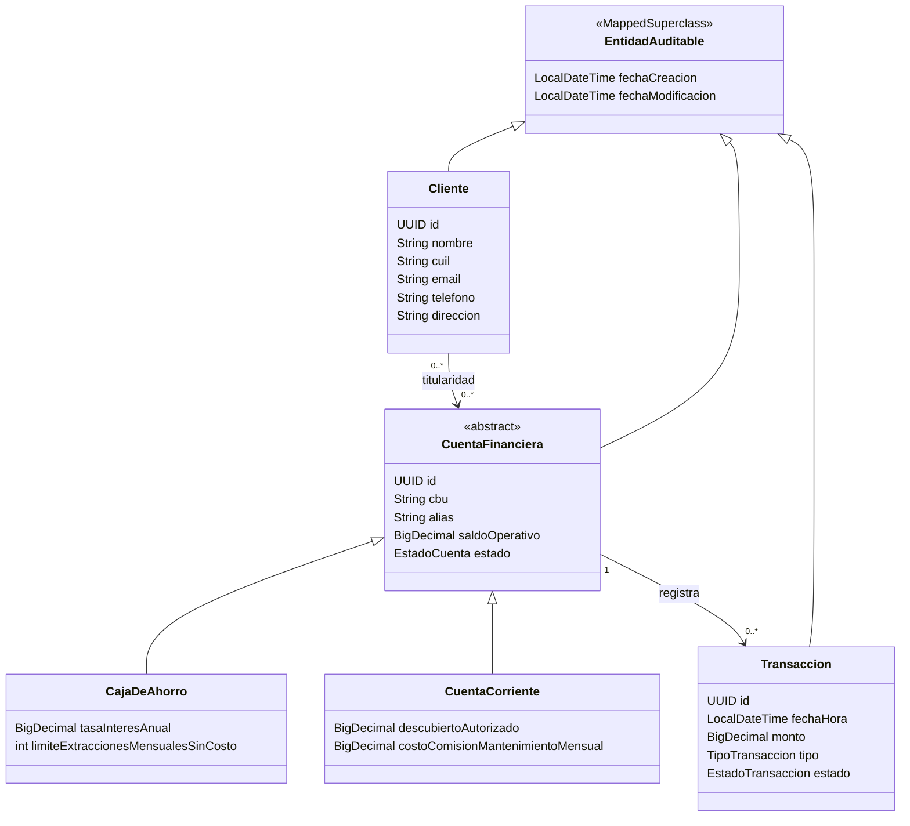

# 🏦 Sistema Bancario — Proyecto DAAS

<p align="center">

**Desarrollo y Arquitecturas Avanzadas de Software**

Ingeniería en Informática · Universidad Nacional de Jujuy

<br>


</p>

---

## 📌 Descripción

Proyecto desarrollado para la asignatura **Desarrollo y Arquitecturas Avanzadas de Software** de la carrera **Ingeniería en Informática — Universidad Nacional de Jujuy**.

El proyecto modela el núcleo de un **sistema bancario**, aplicando conceptos de:

* Programación Orientada a Objetos.
* Persistencia mediante JPA/Hibernate.
* Herencia de entidades.
* Relaciones entre entidades.
* Auditoría automática.
* Integridad y restricciones en base de datos.
* Capas de Repository y Service.
* Pruebas automatizadas.

Actualmente el proyecto se encuentra en evolución a partir de los trabajos prácticos de la asignatura.

---

## 🏦 Dominio del sistema

El sistema representa las principales entidades involucradas en la gestión de cuentas bancarias:

### 👤 Clientes

Permite representar a los clientes de la entidad bancaria mediante sus principales datos identificatorios:

* Nombre / Razón Social
* CUIL
* Email
* Teléfono
* Dirección

### 💳 Cuentas financieras

Se utiliza una entidad abstracta `CuentaFinanciera` como base para los distintos tipos de cuentas.

Cada cuenta posee:

* Identificador `UUID`
* CBU
* Alias
* Saldo operativo
* Estado
* Fecha de creación
* Fecha de última modificación

Los tipos concretos de cuenta contemplados son:

* **Caja de Ahorro**
* **Cuenta Corriente**

La herencia JPA se implementa mediante la estrategia:

```text
InheritanceType.JOINED
```

### 💰 Transacciones

El dominio contempla operaciones realizadas sobre las cuentas bancarias, incluyendo:

* Depósitos
* Extracciones
* Transferencias enviadas
* Transferencias recibidas

Cada transacción posee información relacionada con su fecha, monto, tipo y estado de procesamiento.

---

## 🧱 Arquitectura

La aplicación sigue una arquitectura por capas orientada a separar responsabilidades:

```text
┌─────────────────────────────┐
│          Service            │
│      Lógica de negocio      │
└──────────────┬──────────────┘
               │
┌──────────────▼──────────────┐
│         Repository          │
│      Acceso a datos         │
└──────────────┬──────────────┘
               │
┌──────────────▼──────────────┐
│       JPA / Hibernate       │
│        Persistencia ORM     │
└──────────────┬──────────────┘
               │
┌──────────────▼──────────────┐
│           MySQL             │
│        Base de datos        │
└─────────────────────────────┘
```

> La implementación de las capas `Repository` y `Service` corresponde al desarrollo progresivo del proyecto según los trabajos prácticos de la asignatura.

---

## 🛠️ Tecnologías

| Tecnología          | Versión / Uso                    |
| ------------------- | -------------------------------- |
| **Java**            | 25                               |
| **Spring Boot**     | 4.1.1                            |
| **Spring Data JPA** | Persistencia                     |
| **Hibernate**       | ORM                              |
| **MySQL**           | 8.4.11                           |
| **Maven Wrapper**   | Gestión y ejecución del proyecto |
| **Lombok**          | Reducción de código repetitivo   |
| **JUnit**           | Testing                          |

---

## 🗄️ Persistencia e integridad

La persistencia se implementa utilizando **JPA/Hibernate** sobre MySQL.

Entre las restricciones actualmente verificadas se encuentran:

* `CBU` obligatorio.
* `CBU` único.
* Longitud máxima de CBU de 22 caracteres.
* `Alias` obligatorio.
* `Alias` único.
* Identificadores mediante `UUID`.
* Herencia mediante estrategia `JOINED`.
* Relaciones mediante claves foráneas.
* Fechas de auditoría automáticas.

Por ejemplo, las restricciones de `CBU` y `Alias` se reflejan directamente en el esquema generado por Hibernate:

```text
cuentas_financieras
├── id
├── cbu                 UNIQUE NOT NULL
├── alias               UNIQUE NOT NULL
├── saldo_operativo
├── estado
├── fecha_creacion
└── fecha_modificacion
```

---

## 🕒 Auditoría

Las entidades auditables heredan de:

```java
EntidadAuditable
```

Esta clase utiliza:

```java
@CreatedDate
@LastModifiedDate
```

junto con:

```java
@EnableJpaAuditing
```

para registrar automáticamente:

* `fechaCreacion`
* `fechaModificacion`

El comportamiento fue verificado mediante pruebas de integración con Spring Boot y JPA.

---

## 📐 Modelo de dominio



---

## 📂 Estructura del proyecto

```text
tp2/
├── src/
│   ├── main/
│   │   ├── java/
│   │   │   └── ar/edu/unju/fi/arquitecturas/tp2/
│   │   │       ├── model/
│   │   │       ├── repository/
│   │   │       ├── service/
│   │   │       └── Tp2Application.java
│   │   │
│   │   └── resources/
│   │       └── application.yml
│   │
│   └── test/
│       └── java/
│
├── pom.xml
├── mvnw
├── mvnw.cmd
└── README.md
```

---

## ⚙️ Requisitos previos

Antes de ejecutar el proyecto se necesita tener instalado:

* **JDK 25**
* **MySQL 8.4.x**
* Git

No es necesario instalar Maven de forma global, ya que el proyecto utiliza **Maven Wrapper**.

---

## 🗃️ Configuración de MySQL

Crear el esquema:

```sql
CREATE DATABASE tp2;
```

La aplicación utiliza variables de entorno para evitar almacenar credenciales directamente en el repositorio.

### Windows PowerShell

```powershell
$env:DB_HOST="localhost"
$env:DB_PORT="3306"
$env:DB_NAME="tp2"
$env:DB_USERNAME="root"
$env:DB_PASSWORD="TU_CONTRASEÑA"
```

> ⚠️ La contraseña real de MySQL no debe almacenarse en `application.yml`, README, commits ni en el repositorio remoto.

La configuración utiliza:

```yaml
spring:
  datasource:
    url: jdbc:mysql://${DB_HOST}:${DB_PORT}/${DB_NAME}?serverTimezone=UTC
    username: ${DB_USERNAME}
    password: ${DB_PASSWORD}

  jpa:
    show-sql: true
    hibernate:
      ddl-auto: update
```

---

## ▶️ Ejecución

Desde la carpeta del proyecto:

### Windows

```powershell
.\mvnw.cmd spring-boot:run
```

### Ejecutar las pruebas

```powershell
.\mvnw.cmd test
```

Para ejecutar únicamente las pruebas de auditoría:

```powershell
.\mvnw.cmd -Dtest=AuditoriaTest test
```

---

## 🧪 Testing

El proyecto incorpora pruebas automatizadas para verificar comportamientos de persistencia.

Actualmente se verifica, entre otros aspectos:

* Creación de entidades.
* Persistencia mediante JPA.
* Generación automática de fechas de auditoría.
* Actualización de entidades.
* Integración entre Spring Boot, JPA, Hibernate y MySQL.

Ejemplo de ejecución:

```text
Tests run: 1
Failures: 0
Errors: 0
Skipped: 0

BUILD SUCCESS
```

## 👨‍💻 Autores

**Facundo Ezequiel Tolaba Catarí**
**Maximiliano Luis Esteban Diaz**

**Ingeniería en Informática — UNJu**
**Desarrollo y Arquitecturas Avanzadas de Software · 2026**

---

<p align="center">

**Proyecto académico — DAAS**

</p>
